# Plant Cafe


[Link to Live Site](https://www.davidindub.com/plant-cafe/)

- [Plant Cafe](#plant-cafe)
  * [Introduction](#introduction)
  * [User Stories](#user-stories)
  * [UX](#ux)
    + [Colour Scheme](#colour-scheme)
    + [Typography](#typography)
    + [Wireframes](#wireframes)
  * [Features](#features)
    + [Existing Features](#existing-features)
    + [Features Left to Implement](#features-left-to-implement)
  * [Technologies Used](#technologies-used)
  * [Testing](#testing)
  * [Deployment](#deployment)
    + [Local Deployment](#local-deployment)
  * [Credits](#credits)
    + [Content](#content)
    + [Media](#media)
    + [Acknowledgements](#acknowledgements)


## Introduction

- The project is to make a simple website for a Cafe and Houseplant Shop in Dublin City.

- The shop serves specialty coffee and plant-based food, sells houseplants in store and frequently hosts events about growing plants.

- The plants are not sold online, but the website will include some tips on keeping houseplants, as well as a signup form for a newsletter on upcoming events.

- The main target of the website are people looking for quick information such as the food & drinks menu, or the location and opening hours of the shop and it is expected most of these visitors will be checking the website quickly on a mobile device. Delivering this information quickly and clearly is the main aim of the project, and the language used is friendly and welcoming.


## User Stories

- As a tourist, I want to find out when the café is open, and if it has WiFi and where it is so I can visit and use my laptop.

- As a plant enthusiast, I want to find out about upcoming events.

- As a vegan, I want to find out if there is many options for me to eat at the cafe so I can meet my friend for lunch.

- As a wheelchair user, I want to find out if the cafe has accessible facilities so I can plan my visit.

User story testing was undertaken and reported in [TESTING.md](./documentation/TESTING.md).

## UX  

  I wanted the project to look soft and earthy. I knew I wanted to use green to fit the theme of plants, and I found gorgeous soft-focus photographs on Unsplash that achieved this feeling.

### Colour Scheme

  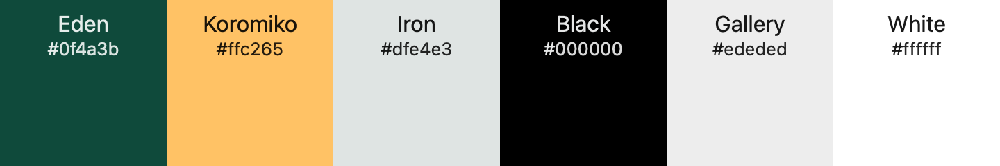

  I was inspired by [Tanim Khan](https://dribbble.com/shots/14147142-Plant-Shop-Landing-Page)'s mockup for a cactus shop on Dribble for the color scheme of dark green and light grey, I used ColorSlurp to find the colors in the image.

### Typography

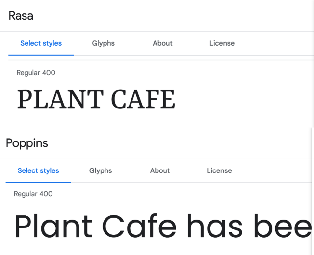

I wanted a sophisticated serif font for the logo and headings paired with a sans serif font for the body text that looked great on all devices.
I typed the title of the project 'Plant Cafe' into [Google Fonts](https://fonts.google.com/) and looked through the Serif fonts until I found one I liked and I picked [https://fonts.google.com/specimen/Rasa](Rasa)). Google Fonts recently removed the pairings feature, so I used [Font Joy](https://fontjoy.com/) to find a highly legible font that paired well with Rasa and I chose the popular font [Poppins](https://fonts.google.com/specimen/Poppins).

### Wireframes

  I sketched my wireframes on paper and on an iPad using Concepts as I had recently completed the Udemy course [Sketching for UX Designers](https://www.udemy.com/share/101Zi03@dvXU0Ao_hYLw14VYm-w9uAFuMOpq-Xw2zw-m4U8GxK5v_ac9Qo-mX_OvZVINv60EgQ==/)

  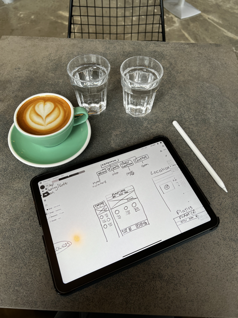

  All the wireframes and planning can be seen in [WIREFRAMES.md](/documentation/WIREFRAMES.md).

## Features 

### Existing Features

- __Navigation Bar__

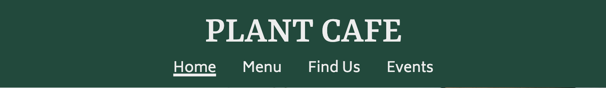


  - All pages feature the same responsive navigation bar with links to the Landing Page, Food Menu, Location & Contact Form, and Events page. This allows the user to easily navigate the site.

  - The page the user is currently on is marked with a subtle underline to aide navigation.

  - This section will allow the user to easily navigate from page to page across all devices without having to revert back to the previous page via the ‘back’ button. The links are gold and underlined when hovered over with the cursor.

***

- __The landing page image__

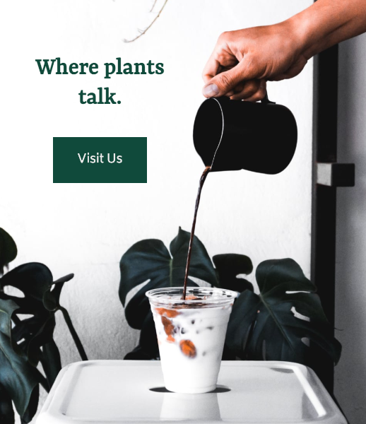


  - The landing page features a large eye catching photograph with text overlayed, the text adapts so that the image does not get obscured different screens sizes.
  - It also features button which when clicked scrolls the page down to the most important information the users might be looking for.

***

- __Cards on Landing Page__

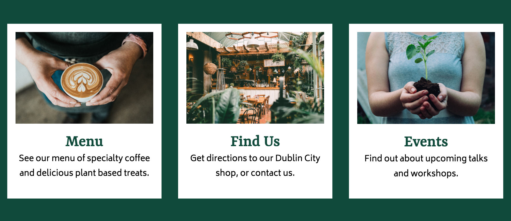

  - Three cards with related photographs describe the three pages of the website where the user might like to visit to find out information.
  - Clicking anywhere on each of these cards takes the user to the associated page, making the links easy to tap on mobile. There is a subtle underline and color change on hover/focus.
  - The cards stack on mobile, and appear as a row on larger screens to make the best use of the user's screen space.

***

- __The Footer__ 

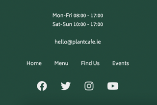 

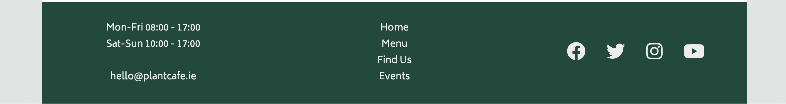

  - The footer section includes the physical address and email address of the cafe, navigation links to the other pages of the website, and links to the cafe's social media accounts (all open in a new tab so as not to end the users visit to the Plant Cafe site)
  - The footer is responsive, the three sections and the nav links stack on mobile view, but use the extra available space on larger screens.

***

- __Menu__

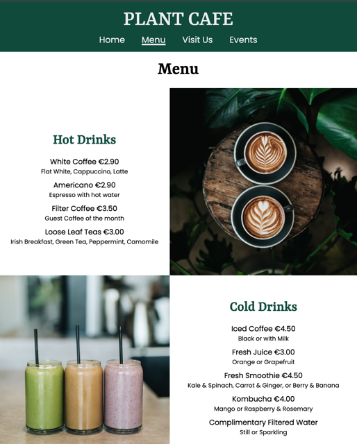

  - The Menu page provides the user with the list of Food and Drink options and prices available at the cafe along side images of some of the dishes.

***

- __Visit Us__

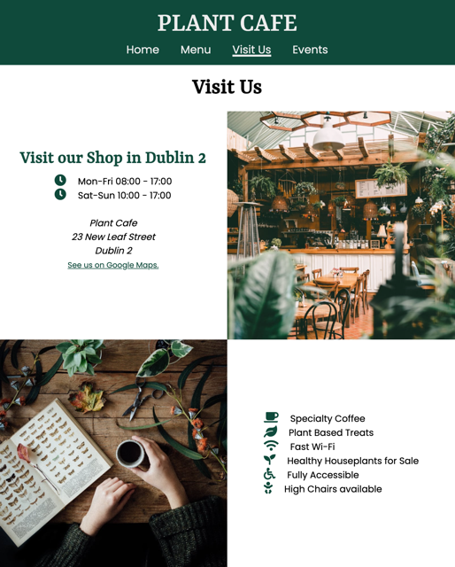


  - This page provides information about the facilities of the cafe, the address, an embedded Google Map of the location, and a form to to contact the cafe.

  - **Note:** This page was originally titled "Find Us", however during user story testing I decided "Visit Us" more appropriately described the content of the page, which includes more than just the location of the Cafe.

***

- __Events__

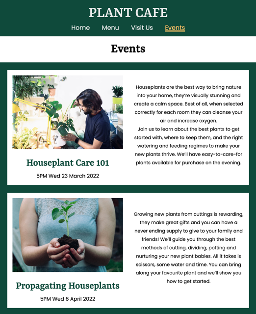


  - This page lists upcoming events happening at the cafe, an embedded video with houseplant tips, and provides a form for a newsletter for users to find out about future events.

***

### Features Left to Implement

- The contact us form and newsletter signup currently don't submit to a server, but to a static page thanking the user for their submission.
- The embedded video could be lazy-loaded using JavaScript to improve performance on mobile.
- The project could be built out further to include a page of Plants for sale, or even an online shop selling houseplants and coffee.

## Technologies Used

- [HTML](https://en.wikipedia.org/wiki/HTML) for the content of the pages, which are all static .html files. I used semtantic elements where availble to help assistive technologies and improve SEO.
- [CSS](https://en.wikipedia.org/wiki/CSS) for styling the pages and creating the responsive design.
  - __CSS Grid__ was invaluable for creating a responsive design in which elements are rearranged on the page depending on the screen size. I used `grid-area` and `grid-template-area` to arrange the sections on the page by name using media queries.

  Example:
  ```css
      #findus-content {
        grid-template-columns: 1fr 1fr;
        grid-template-areas:
            "page-title page-title"
            "findus-address findus-img"
            "findus-img2 findus-facilities"
            "findus-map findus-map"
            "findus-form findus-form";
    }
    ```

  - __CSS Variables__ were used to store the color pallete and fonts used, and then referenced in the styles. This improved readability and could be useful in future for changing colors, for example building a dark mode.
  Example:
  ```css
  :root {
    --main-bg-color: rgb(223, 228, 227);

    --font-headings: 'Rasa', serif;
    }
    ```

- [Git](https://git-scm.com/) for version control.
- [GitHub](https://github.com/) for storing the repository online during development.
- [GitPod](https://gitpod.io/) as a cloud based IDE.
- [Font Awesome](https://fontawesome.com/) for icons used in the project.
- [Google Fonts](https://fonts.google.com/) for the two fonts used on the project.
- [Eagle](https://en.eagle.cool/) for organising my images locally.
- [Pixelmator Pro](https://www.pixelmator.com/pro/) for resizing and converting images.
- [favicon.io](https://favicon.io/favicon-generator/) to make a favicon for site.
- [Meta Tags](https://metatags.io/) to prepare the Meta tags for social media share previews.
- [Polypane](https://polypane.app/) for testing responsiveness on different viewports at the same time.
- [Google Chrome](https://www.google.com/intl/en_ie/chrome/), [Mozilla Firefox](https://www.mozilla.org/en-US/firefox/new/) and [Safari](https://www.apple.com/safari/) for testing on macOS Monterey, Windows 10, iOS 15, iPadOS 15 and Android 10.
- [ColorSlurp](https://colorslurp.com/) for picking my color palette and testing for perfect accessibility.
- [Concepts](https://concepts.app/en/) for sketching on an iPad.


## Testing 

Please visit [TESTING.md](./documentation/TESTING.md) for detailed testing and bugs discovered.


## Deployment

The site was deployed to GitHub pages. The steps to deploy are as follows: 
  - In the [GitHub repository](https://github.com/davidindub/plant-cafe), navigate to the Settings tab 
  - From the source section drop-down menu, select the **Main** Branch, then click "Save".
  - The page will be automatically refreshed with a detailed ribbon display to indicate the successful deployment.

The live link can be found [here](https://www.davidindub.com/plant-cafe)

### Local Deployment
The steps to deploy are as follows: 
  - In the GitHub repository, navigate to the Settings tab 
  - From the source section drop-down menu, select Main Branch
  - Once the main branch has been selected, the page will be automatically refreshed with a detailed ribbon display to indicate the successful deployment. 

In order to make a local copy of this project, you can clone it. In your IDE Terminal, type the following command to clone my repository:

- `git clone https://github.com/davidindub/plant-cafe.git`

Alternatively, if using Gitpod, you can click below to create your own workspace using this repository.

[](https://gitpod.io/#https://github.com/davidindub/plant-cafe)


## Credits 

### Content 

- I used [Dribble](https://dribbble.com/) to research designs to pick my color palette.
- The text for each page was written by myself, drawing on my past experience as a barista and chef.
- The icons used on the Visit Us page and footer were taken from [Font Awesome](https://fontawesome.com/).
- I used the [MDN Web Docs](https://developer.mozilla.org/en-US/) for help using CSS Variables for the colors and fonts, and help using CSS Grid Template Areas.
- I read [W3 Schools](https://www.w3schools.com/) for information on semantic HTML and Accessibility guidelines. 
- I watched some videos on [Kevin Powell's YouTube channel](https://www.youtube.com/kepowob) for help with responsive design, and learned about the `clamp()` function.
- I discovered the App [Eagle](https://en.eagle.cool/) when starting the project which was invaluable for organising all my reference images in one place, and I will use it in fuutre for all my projects.
- I recently completed the Udemy course [Sketching for UX Designers](https://www.udemy.com/share/101Zi03@dvXU0Ao_hYLw14VYm-w9uAFuMOpq-Xw2zw-m4U8GxK5v_ac9Qo-mX_OvZVINv60EgQ==/) which helped me with sketching my wireframes.

### Media

- The photos used are from [Unsplash](https://unsplash.com/), credit to [Daniela Constantini](https://www.pexels.com/@daniela-constantini), [Fernando Hernandez](https://unsplash.com/@_ferh97), [Nikola Jovanovic](https://unsplash.com/@danteov_seen), [Nathan Dumlao](https://unsplash.com/@nate_dumlao), and [Ruben Ramirez](https://unsplash.com/@pinchebesu).
- I used [favicon.io](https://favicon.io/favicon-generator/) to make the Favicon for the project.


### Acknowledgements

- Thank you to my CI Mentor [Tim Nelson](https://github.com/TravelTimN) for his help and suggestions.
- Thank you again to all the artists mentioned above for their beautiful photographs, I started to believe the Plant Cafe does exist!
- Thanks to my partner David for his constant support on my journey to a new career.
