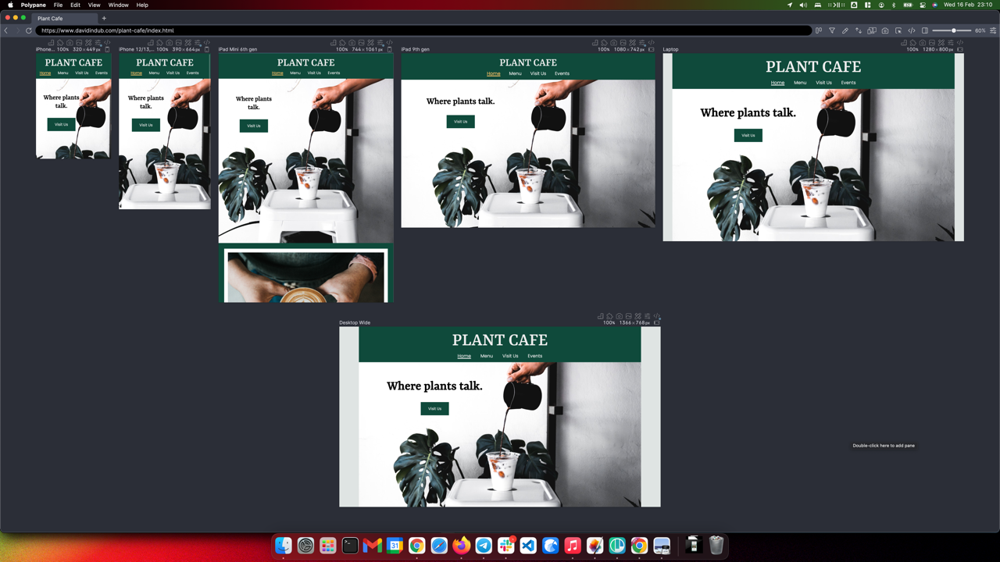
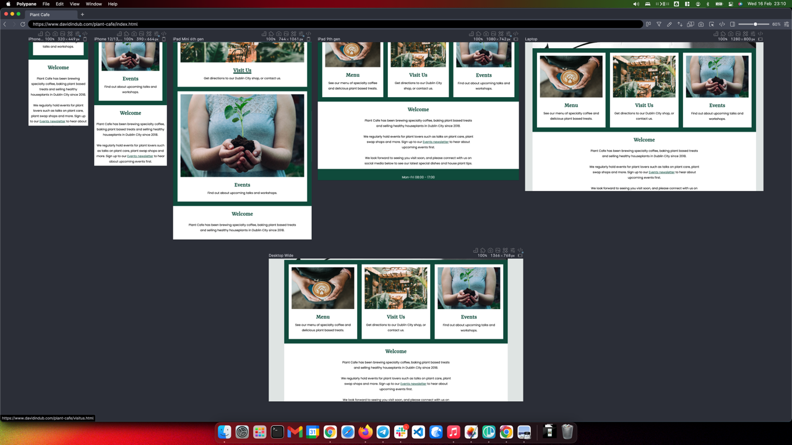
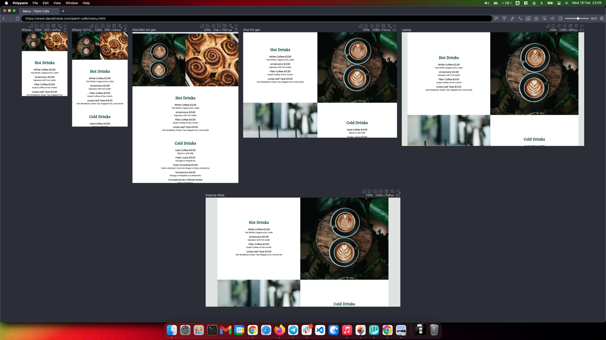
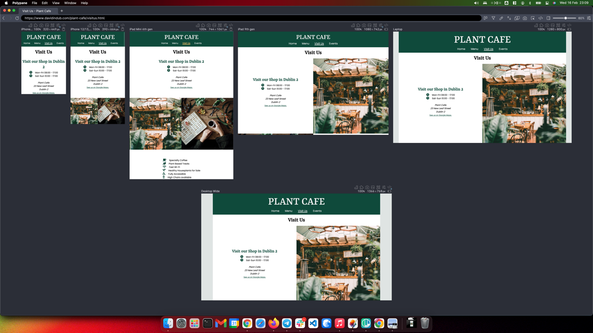
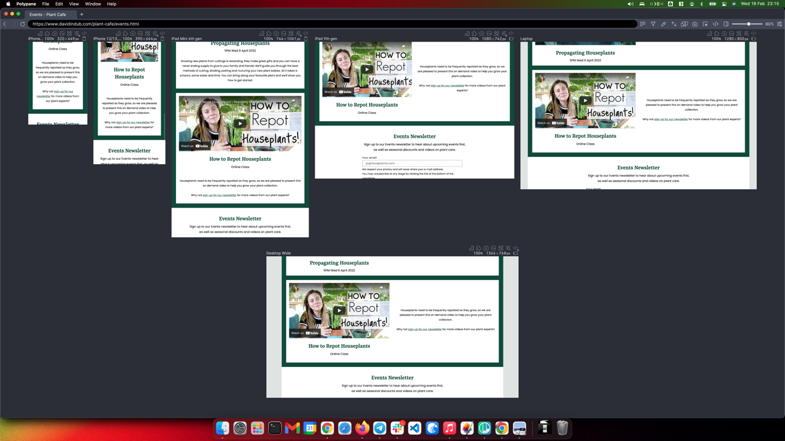
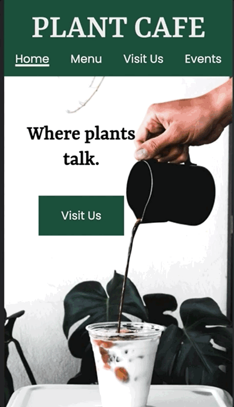
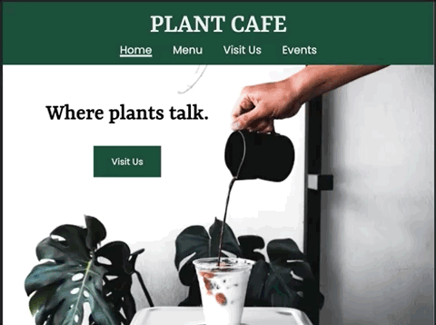
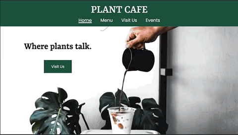
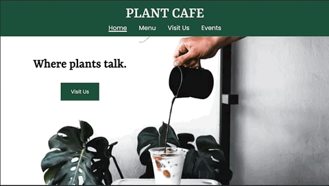

## Testing

### Browser Compatibility

I tested the website on four different operating systems on four different types of hardware.

| Operating System | Chrome | Firefox | Edge | Safari |
|------------------|--------|---------|------|--------|
| macOS 12.2       | ✅      | ✅       | ✅    | ✅❗️     |
| Windows 10       | ✅      | ✅       | ✅    | N/A     |
| Android 10       | ✅      | ✅       | ✅    | ✅      |
| iOS & iPadOS 15  | ✅🔸     | 🔸       | 🔸    | ✅      |

❗️ Issue with hover effects in Safari due to known bug - detailed below in Unfixed Bugs.

🔸 All iOS browsers use WebKit for rendering so perform same as Safari)

#### Testing Favicon on all Browsers

### Accessibility

- No errors were detected using the [WAVE Web Accessibility Evaluation Tool](https://wave.webaim.org/report#/https://www.davidindub.com/plant-cafe/).

### Code Validation

- HTML

  - No errors were returned when passing through the official [W3C validator](https://validator.w3.org/nu/?doc=https%3A%2F%2Fwww.davidindub.com%2Fplant-cafe%2F).

    - [Landing Page](https://validator.w3.org/nu/?doc=https://www.davidindub.com/plant-cafe/index.html)
    - [Menu Page](https://validator.w3.org/nu/?doc=https://www.davidindub.com/plant-cafe/menu.html)
    - [Visit Us Page](https://validator.w3.org/nu/?doc=https://www.davidindub.com/plant-cafe/findus.html)
    - [Events Page](https://validator.w3.org/nu/?doc=https://www.davidindub.com/plant-cafe/events.html)

    

- CSS

  - No errors were found when passing through the official [W3C CSS Validation Service](https://jigsaw.w3.org/css-validator/validator?uri=https%3A%2F%2Fwww.davidindub.com%2Fplant-cafe%2F&profile=css3svg&usermedium=all&warning=1&vextwarning=&lang=en).

    

***

### Responsiveness

I tested for responsiveness on many different sized viewports from 320px wide up to Ultrawide resolutions, and using different hardware (Monitors, Laptops, Phones).

  
***
    
### Performance

The project was tested for performance on Mobile and Desktop using [Google Lighthouse](https://developers.google.com/web/tools/lighthouse).

Full results and screenshots of testing can be found at [TESTING-performance.md](/documentation/TESTING-performance.md) and summarized below:

#### Mobile Lighthouse Scores

| **Page** | **Performance** | **Accessibility** | **Best Practices** | **SEO** |
|----------|-----------------|-------------------|--------------------|---------|
| Landing  | 96              | 100               | 100                | 97      |
| Menu     | 96              | 100               | 100                | 96      |
| Visit Us | 81              | 97                | 100                | 97      |
| Events   | 81              | 100               | 100                | 96      | 

#### Desktop Lighthouse Scores

| **Page** | **Performance** | **Accessibility** | **Best Practices** | **SEO** |
|----------|-----------------|-------------------|--------------------|---------|
| Landing  | 99              | 100               | 100                | 100     |
| Menu     | 100             | 100               | 100                | 100     |
| Visit Us | 86              | 97                | 100                | 97      |
| Events   | 100             | 100               | 100                | 100     |

***

### User Story Tests

> As a tourist, I want to find out when the café is open, and if it has WiFi and where it is so I can visit and use my laptop.  

1. I visit the landing page on my mobile, I can see the 'Visit Us' button straight away.

2. I can see that the 'Visit Us' section might contain the information I need so I tap it.

3. I immediately see the opening hours and address of the shop, as well as a link that scrolls down to a Google Map for directions.

4. Just underneath this I can see 'Fast Wi-Fi' listed, so I know I can use my laptop to work.

**Result:** Pass ✅

> As a plant enthusiast, I want to find out about upcoming events.  

1. I visit the landing page and I click 'Events' in the navigation bar.

2. I am taken the the Events page and I can see the next upcoming event.

3. I scroll down and see more events, and finally an Events newsletter form.

4. I enter my email address to the form and click 'Sign Me Up!'

5. I see a confirmation message to let me know I have been subscribed to the Events newsletter, and I am redirected automatically back to the landing page.

**Result:** Pass ✅

> As a vegan, I want to find out if there is many options for me to eat at the cafe so I can meet my friend for lunch.  

1. I see on the landing page that the cafe serves 'Plant based treats'

2. I click through to the Menu and as I scroll down, I see that the cafe serves Lunch from 12:00pm.

3. Underneath this I can see "All milks and ingredients used are vegan", so I know I can have lunch there with my friend.  

**Result:** Pass ✅

> As a wheelchair user, I want to find out if the cafe has accessible facilities so I can plan my visit.

1. I visit the landing page and click the "Visit Us" item in the Nav Bar

2. I scroll down the page and see the Wheelchair symbol and "Fully Accessible", so I know that I can visit the cafe without issues.

**Result:** Pass ✅

***

### Unfixed Bugs

When using Safari, the underline hover effect on the Nav Bar items and Footer Navigation items due to a known bug where `text-decoration-thickness` change on hover stops working at certain font sizes - See [WebKit Bugzilla - Bug 224483](https://bugs.webkit.org/show_bug.cgi?id=224483).
The color change hover effect still works and gives enough of a visual indication to the user that they have hovered over the link.

This shows the behaviour in Safari vs in Chrome/Firefox Edge:

